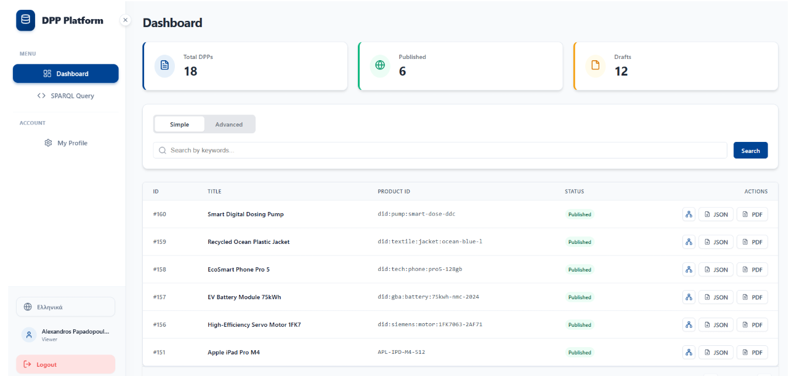
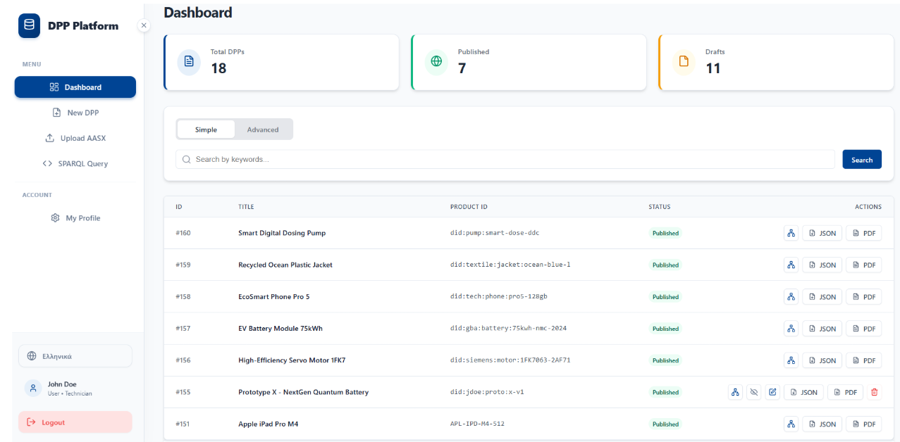
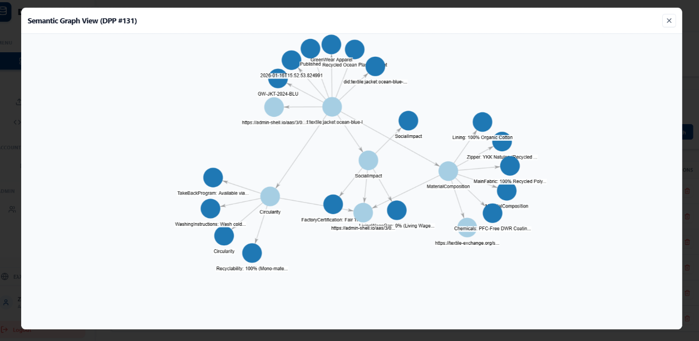
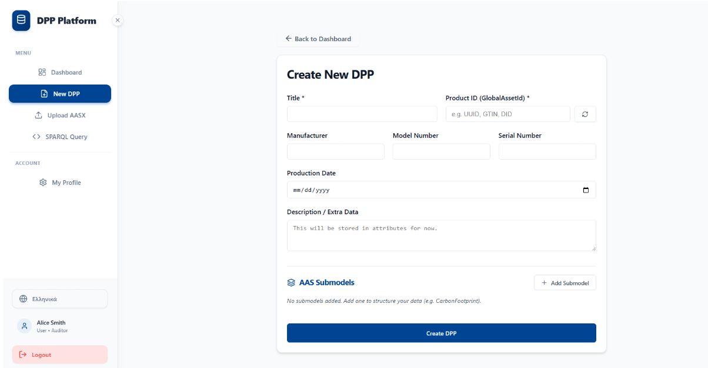
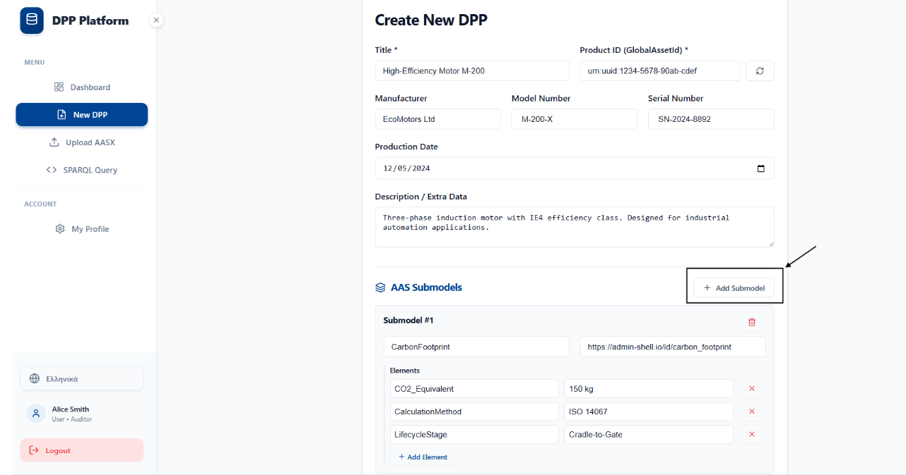
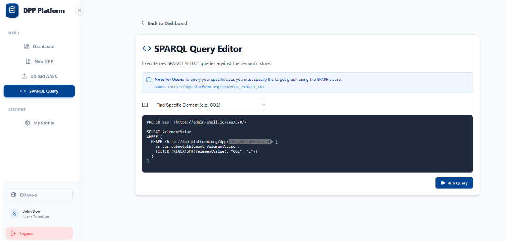
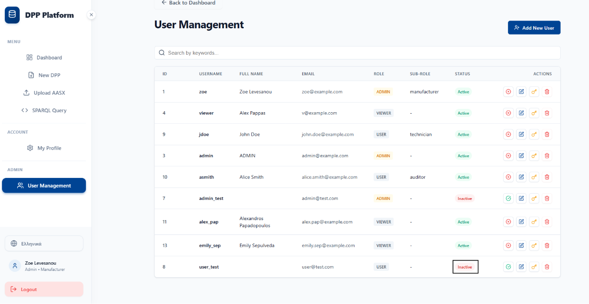

# DPP Frontend

A React-based web application for managing **Digital Product Passports (DPP)** — structured digital records that capture a product's full lifecycle data, from manufacturing to recycling.

---

## What it does

The application allows users to:

- **Browse & search** Digital Product Passports with simple keyword search or advanced multi-field filtering
- **Create & edit** DPPs with rich product data and AAS (Asset Administration Shell) submodels
- **Upload AASX files** to import existing AAS-compliant product data
- **Export** DPPs as JSON or PDF
- **Visualize** semantic relationships between DPPs using an interactive force-directed graph
- **Publish / unpublish** DPPs to control visibility
- **Run SPARQL queries** against the DPP knowledge graph
- **Manage users** (admin only) — create, edit, activate/deactivate, change passwords, delete
- **Multilingual UI** — supports English and Greek (i18next)

---

## Tech Stack

| Layer | Technology |
|---|---|
| Framework | React 19 + Vite |
| Routing | React Router v7 |
| HTTP | Axios (with JWT interceptor) |
| UI Icons | Lucide React |
| Notifications | React Hot Toast |
| Graph View | React Force Graph 2D |
| i18n | i18next + react-i18next |
| Testing | Vitest + Testing Library |
| Container | Docker + Nginx |

---

## Project Structure

```
src/
├── components/
│   ├── Layout.jsx          # App shell with sidebar navigation
│   └── ConfirmModal.jsx    # Shared confirmation dialog
├── pages/
│   ├── Login.jsx
│   ├── Register.jsx
│   ├── Dashboard.jsx       # DPP list, search, stats, graph view
│   ├── CreateDPP.jsx
│   ├── EditDPP.jsx
│   ├── UploadAASX.jsx
│   ├── SparqlQuery.jsx
│   ├── UserManagement.jsx
│   └── UserProfile.jsx
├── services/
│   └── api.js              # Axios instance + all API calls
├── i18n.js                 # Translation configuration
└── App.jsx                 # Routes + auth guard
```

---

## Getting Started

### Prerequisites

- Node.js 18+
- A running DPP backend (set via `VITE_API_URL`)

### Install & run

```bash
npm install
npm run dev
```

### Environment variables

Create a `.env` file at the root:

```env
VITE_API_URL=http://localhost:8000
```

### Run tests

```bash
npm run test
```

### Build for production

```bash
npm run build
```

---

## Docker

```bash
docker build -t dpp-frontend .
docker run -p 80:80 dpp-frontend
```

The container serves the built app through Nginx.

---

## Screenshots

### Dashboard — DPP List & Stats
Viewer Dashboard


User Dashboard



### Semantic Graph View


### Create DPP




### SPARQL Query Editor


### User Management


---

## Authentication

Authentication is JWT-based. The token is stored in `localStorage` and attached automatically to every API request via an Axios interceptor. Unauthenticated users are redirected to `/login`. A `401` response from the backend clears the token and redirects to login.

---

## Roles & Permissions

| Role | Capabilities |
|---|---|
| `ADMIN` | Full access — manage users, publish/delete any DPP |
| `USER` | Create, edit, publish/delete own DPPs |
| `VIEWER` | Read-only access |

Each user also has a **subrole** (e.g. `MANUFACTURER`, `RECYCLER`, `INSPECTOR`) that reflects their position in the product lifecycle.